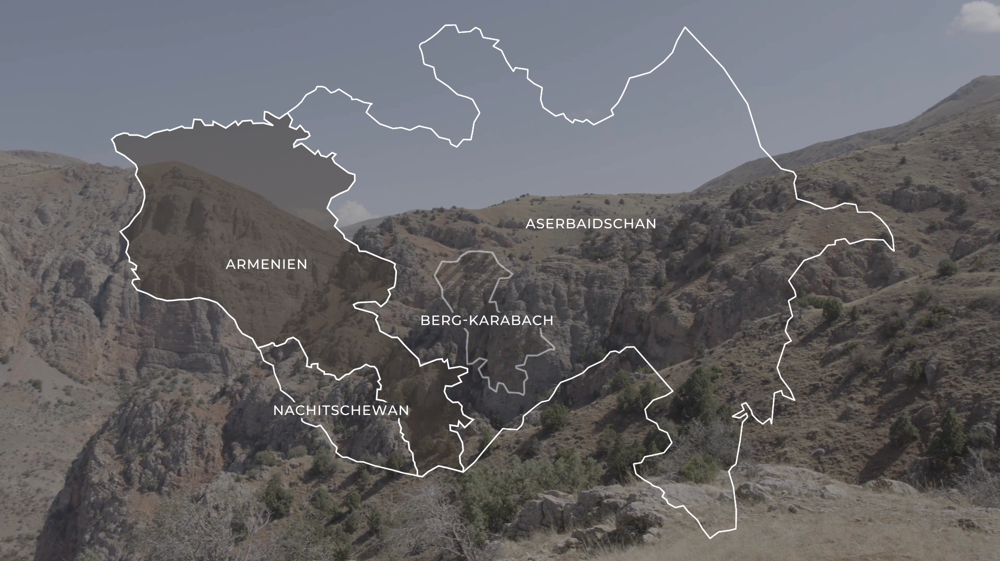
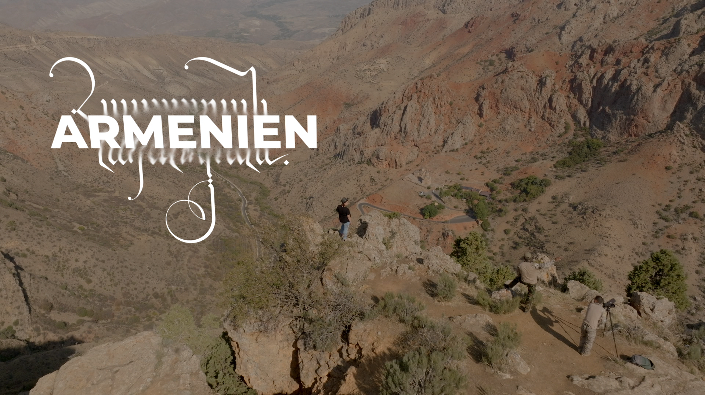
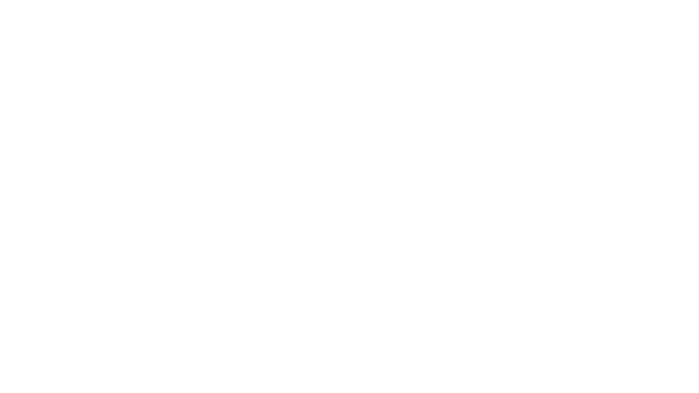
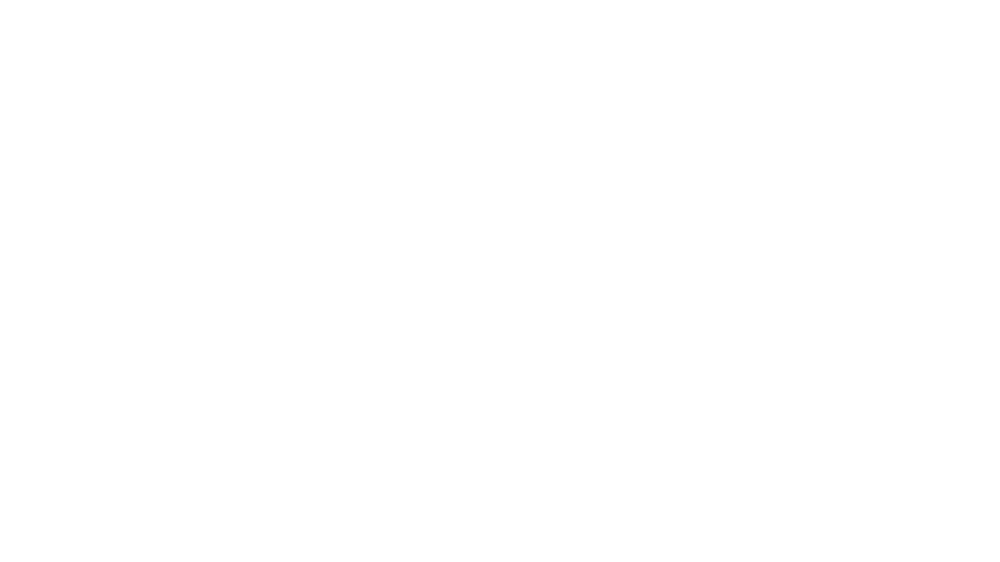

Visual designer for the documentary TV movie *Armenien: Die Rückkehr des Leoparden*. 

For the title design of this ARTE documentary, we conducted extensive **Armenian calligraphy and ink tests** to capture the soul and ancient history of the region. Armenian calligraphy is an extraordinary art form, characterized by its intricate "bird-letters" (*Trchnagir*) and ornamental scripts that have evolved over more than a millennium.

A significant inspiration for our work was the renowned artist and calligrapher **Ruben Malayan**, whose commitment to preserving and contemporary evolution of the Armenian calligraphic tradition provided a vital creative reference. By experimenting with physical ink textures and digital animation, we aimed to create a visual identity that reflects the rugged beauty of the Armenian landscape and its deep cultural heritage.

### Ink & Calligraphy Studies
The process began with analog ink tests to find the right balance between traditional script and modern visual storytelling.

### Final Title & Logo Design
The final design integrated these calligraphic elements into the title sequence and promotional maps.

  
  

