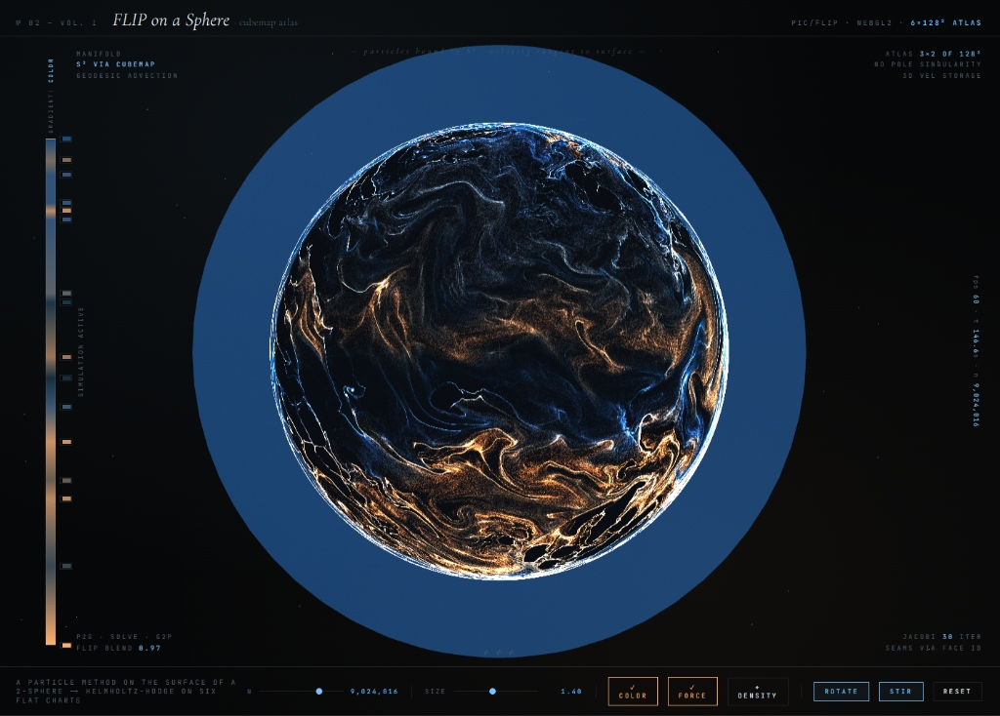

### The Experiment

I've always been fascinated by the complex, swirling patterns of gas giant atmospheres like Jupiter and Saturn. While most fluid simulations are performed on flat 2D planes or in full 3D volumes, I wanted to explore the unique challenges of solving the Navier-Stokes equations on a non-Euclidean manifold—specifically a sphere.

This experiment uses a **FLIP (Fluid-Implicit Particle)** method adapted for a spherical surface. To avoid the mathematical "pole singularity" problem (where grid cells become infinitely small at the poles), I implemented a **cubemap atlas formulation**. The simulation runs across six flat charts that wrap around the sphere, with custom logic to handle velocity and pressure lookups across the seams.

### Key Features

- **FLIP Particle Method:** Particles live on the unit sphere ($S^2$) with 3D velocity vectors tangent to the surface.
- **Cubemap Atlas:** The velocity grid is stored on a 3x2 atlas of 128² faces, ensuring uniform resolution across the entire manifold.
- **Helmholtz-Hodge Decomposition:** Real-time pressure solve using a Jacobi iterator to maintain an incompressible flow field.
- **Geodesic Advection:** Particles are moved along great circles based on their local tangent velocity.

### Live Experiment

Explore the real-time simulation with interactive controls, cubemap export, and particle data export:

    <a href="/experiments/gas-giant.html" class="inline-flex items-center px-8 py-4 text-lg font-bold text-white transition-all bg-primary-600 rounded-lg hover:bg-primary-500 hover:scale-105 shadow-xl shadow-primary-900/20">
        Launch Gas Giant Experiment &nbsp; &rarr;
    </a>

*(Note: Requires WebGL2 support. Best experienced on desktop.)*
