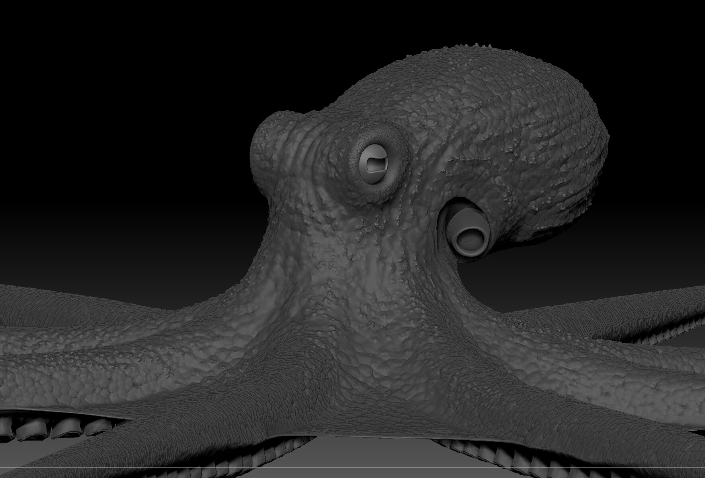
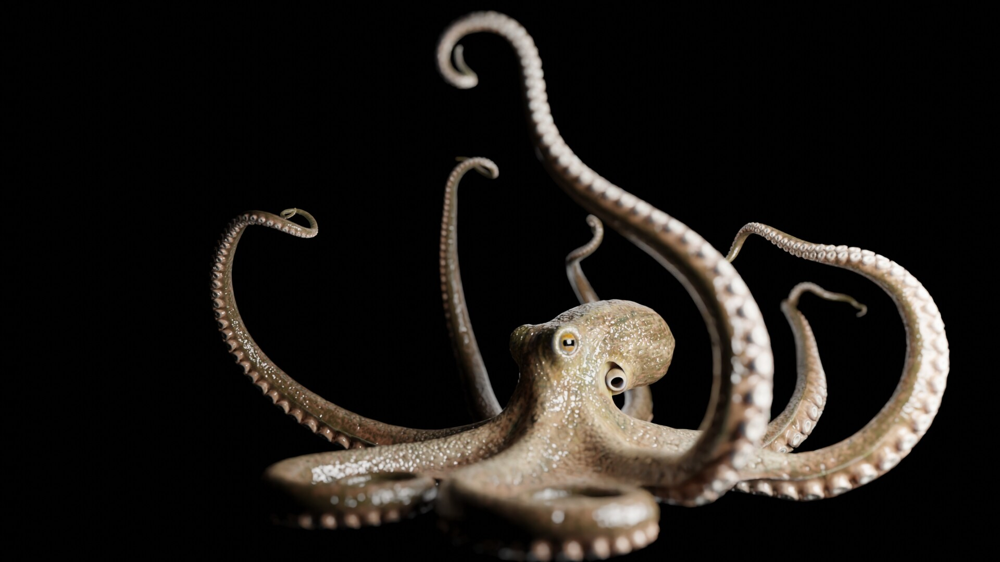

A personal project dedicated to my favorite animal: the octopus. This study was a deep dive into organic modeling and technical rigging, completed in 2021.

### Sculpting & Modeling
The process began in **ZBrush**, where I focused on capturing the unique anatomy and fluid forms of the octopus. I spent significant time sculpting the intricate details of the skin texture and the complex structure of the tentacles.

### Rigging & Final Polish
After sculpting the high-poly model, I performed retopology and developed a custom rig to handle the extreme flexibility required for cephalopod movement. The goal was to create a character that felt both anatomically grounded and expressive.

