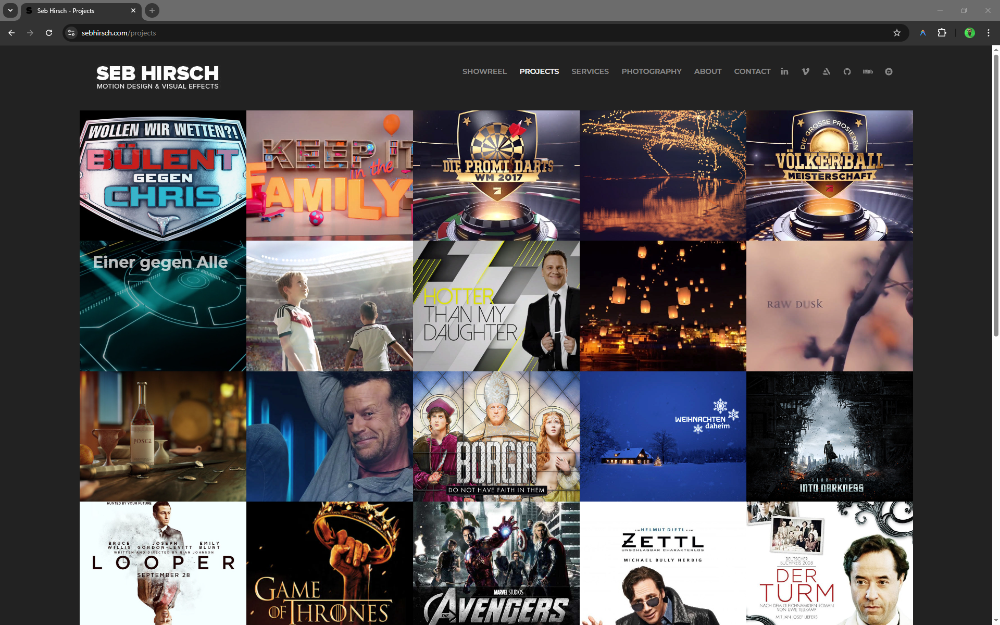
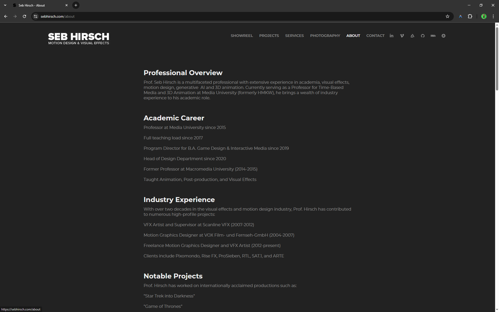

This project represents the transition of my professional portfolio from a proprietary platform (Adobe Portfolio) to a custom-built, static site generated with **Hugo**.

### The Motivation
Adobe Portfolio provided a convenient starting point, but I reached the limits of its customization. As a Technical Director and Professor, I wanted a site that offered full ownership and technical flexibility.

### Visual Evolution: From "Monolithic" to "Six Bars"
The original Adobe Portfolio design used a **Monolithic approach**: a single background color applied to the entire page, relying on spacing and bold typography to separate the components. 

In contrast, our new architecture utilizes a **"Six Bars" structural logic**. This system breaks the monolithic block into distinct horizontal strips (bars) that create a more cinematic and organized visual rhythm:
1.  **Nav Bar**: Deep Black foundation.
2.  **Section Banner**: Medium Grey intro strip.
3.  **Content Body**: High-contrast Dark Grey narrative area.
4.  **Imprint Segment**: Specialized legal footer bar.
5.  **Social Icon Segment**: Interactive connection strip.
6.  **Copyright Segment**: Final architectural anchor.

### The Reverse Engineering Process
The goal was to capture the professional, high-density essence of the original site while using **Hugo** and **Tailwind CSS**. A key role was played by the **Antigravity AI**, which helped bridge the transition:

*   **Extraction of Truth**: We began by parsing my 11-page career history from a PDF into a structured `information.md` file, creating a "Single Source of Truth" for every project and academic milestone.
*   **Narrative Strategy**: The AI assisted in implementing a "Hybrid Voice" (personal first-person hero greeting vs. authoritative third-person professional bio) to maintain accessibility while showcasing academic authority.
*   **Cinematic Standards**: We enforced strict visual rules, standardizing all key imagery to a **3:2 Aspect Ratio** with top-anchored cropping to ensure high-end visual continuity across the entire site.
*   **Technical Sovereignty**: By reverse-engineering the logic and canceling the Adobe subscription, I have achieved total ownership of the assets and code. The site is no longer a rental residence; it is a custom-built technical headquarters.
